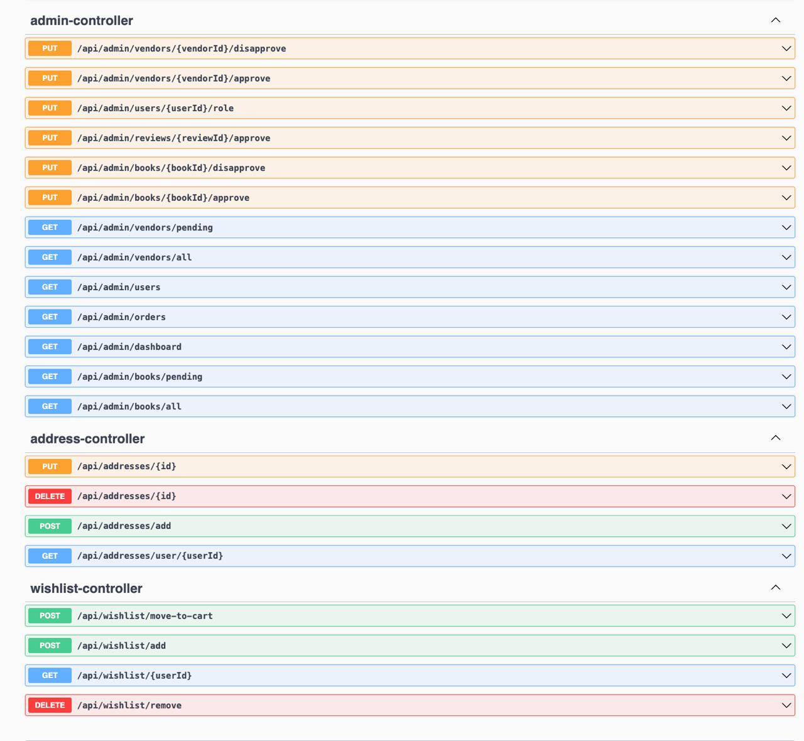
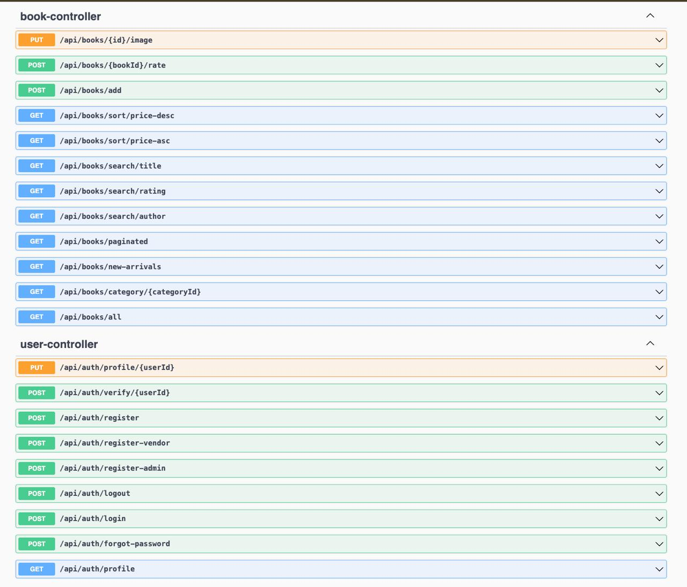
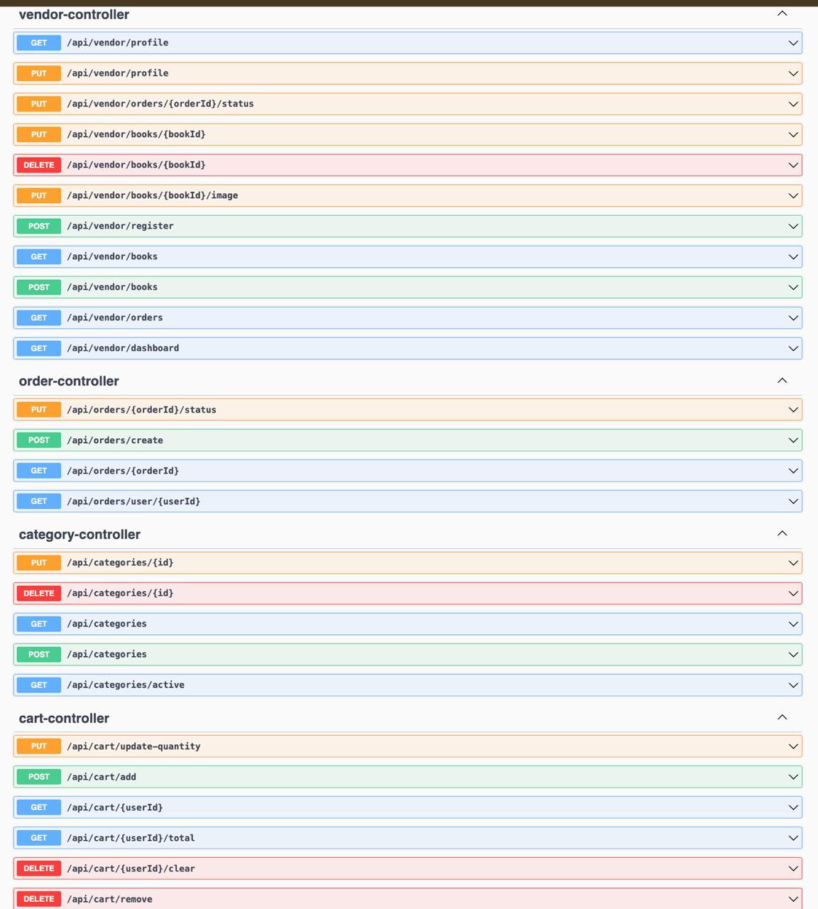

# 📚 Book Store Management System

A modern full-stack application for managing a digital bookstore, built with Spring Boot and React. This system provides a comprehensive solution for book inventory management, user authentication, and order processing.

# 🌐 Domain
E-commerce / Retail / Book Management

# 🎯 Objectives

- Manage book inventory with detailed information
- Handle user authentication and authorization
- Process and track book orders
- Provide an intuitive admin interface
- Offer a responsive user experience

# 🧱 Tech Stack
Layer | Technology
------|------------
Frontend | React + CSS
Backend | Spring Boot 3.1.5
Security | Spring Security + JWT
Persistence | Spring Data JPA
Database | MySQL
Build Tools | Maven (Backend), npm (Frontend)
Documentation | Swagger (springdoc-openapi)
Logging | Log4j2

# 🧩 Key Modules

- User Authentication & Authorization
- Book Inventory Management
- Order Processing
- Admin Dashboard
- User Profile Management

# 🔐 Roles & Access
Role | Access Description
-----|-------------------
Admin | Full access to manage books, users, and orders
User | Browse books, manage profile, place orders
Vendor | Manage their own book inventory and view sales
Guest | View books and public information

# 🗃 Entity Overview

- User: id, username, email, password, role
- Book: id, title, author, price, category, stock
- Order: id, userId, status, orderDate
- OrderItem: id, orderId, bookId, quantity

# 🔁 REST API Endpoints

## 🔐 AuthController

- POST /api/auth/register
- POST /api/auth/login

## 📚 BookController

- GET /api/books
- GET /api/books/{id}
- POST /api/books (Admin)
- PUT /api/books/{id} (Admin)
- DELETE /api/books/{id} (Admin)

## 👤 UserController

- GET /api/users/profile
- PUT /api/users/profile
- GET /api/users (Admin)

## 🛒 OrderController

- POST /api/orders
- GET /api/orders
- GET /api/orders/{id}
- PUT /api/orders/{id}/status (Admin)

# 📁 Project Structure

```
com.bookstore.bookstore_app
├── config/
├── controller/
├── dto/
├── entity/
├── exception/
├── repository/
├── service/
└── BookstoreAppApplication.java

frontend/
├── src/
│   ├── components/
│   ├── pages/
│   ├── services/
│   └── App.js
└── package.json
```

# 📊 Database Design


# 📝 Class Diagram


# 📘 Swagger Documentation







# ▶️ How to Use the Project

## 🛠 Prerequisites

- Java 17+
- Springboot
- Node.js and npm
- MySQL database
- Maven

## 🚀 Steps to Run

1. Clone the Repository

```bash
git clone <repository-url>
cd book-store
```

2. Set up the Database

- Create a MySQL database
- Update application.properties with your database credentials

3. Run the Backend

```bash
cd bookstore-app
mvn clean install
mvn spring-boot:run
```

4. Run the Frontend

```bash
cd frontend
npm install
npm start
```

5. Access the Application

- Frontend: http://localhost:3000
- Swagger UI: http://localhost:8080/swagger-ui.html
- API Base URL: http://localhost:8080/api

## 📌 Features

- Responsive UI with modern design
- Secure JWT authentication
- Role-based access control
- Real-time inventory management
- Order tracking system
- Admin dashboard
- User profile management

## 🔧 Configuration
The application can be configured through:

- Backend: `application.properties`
- Frontend: environment variables

## ⚙️ Environment Variables

```properties
# Backend (application.properties)
spring.datasource.url=jdbc:mysql://localhost:3306/bookstore
spring.datasource.username=your_username
spring.datasource.password=your_password

# Frontend (.env)
REACT_APP_API_URL=http://localhost:8080/api
```

# 🧪 Testing

- Backend: JUnit tests available in the test directory

# 👥 Authors

- [Arnav Saharan](https://github.com/Arnavsaharann)
- [Kanika Agrawal](https://github.com/kanikaagrawal21)
- [Vibhor Gupta](https://github.com/vibhorg27)
- [Sreyas Sannuthi](https://github.com/Sreyas-17)
- [Mayank Pal](https://github.com/mayankpall)
